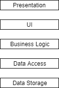
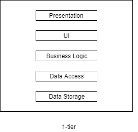
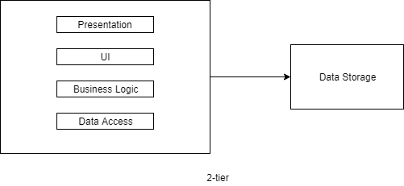
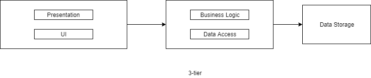
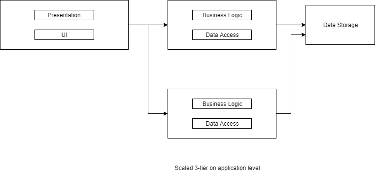

There are differences between N-layer and N-tier definitions. We can start with explaining those first:

## 5-layer Architecture
Layering is logical separation that you implement in your application. It has a relation with N-Tier but we will 
move onto it later:

### Presentation

This is how your application is shown to the user. You can think about it is a look and feel of the application. 
But it is very similar to the UI layer, today's world with the improvement of JavaScript (client-side-rendering solutions like React, Angular, etc.) this separation may not be seem exact 
but still makes sense, let me continue:

### UI

This is where user interactions are interpreted. What happens when user clicks submit button, how the data is sent to 
the server and retrieved? If you think about server-side rendering which we used older times, we were all interpreting 
those and returning user fully ready HTML page but today with client-side-rendering all of those works are done in the 
user's browser with the help of JavaScript. So you can think about now Presentation + UI is done in users server 
(phone, pc etc.) if client-side-rendering is used. If the user's server is only responsible for showing the data, 
now the Presentation layer takes place there while UI layer takes place in our server.

### Business Logic

This is the place where we are responsible for data validation (even if you did it in client-side, 
we should do in server-side too because we never trust to clients), manipulation, security, processing, 
database lookups, etc. takes place. Those responsibilities can be shared between UI side and Data Access depending 
on the action's security scope

### Data Access

This is where you abstract to insert, delete, etc. actions that you need to do on the DataBase (Data Storage level). 
It kinda interfaces between DataBases and your application

### Data Storage

This is were database servers belong. This is the implementation of the 
Data Access layer which psychically inserts, deletes, etc. data on the server.

## 5-Tier Architecture

Now depending on your application's needs, you should define your trade-offs:

 - What do you want to achieve?
 - How much do you want to scale? 
 - What is your acceptable latency?

If you achieve low latency and you don't aim to be used by too many users, you can start with 1-tier. 
In the below demonstrations keep in mind that the business logic layer can be done in any layers as long as you keep 
security reasons, you can have some general/simple business logic in client-side (Presentation/UI layers) too which may 
increase your servers performance. Also, you can put UI layer in higher/lower tiers depend on using server-side or 
client-side rendering but we talked about general idea above:

### 1-tier

All layers belong to one physical location. Like a game that installed on the user's database and 
doesn't request any other external system, it has own database on the user's server and all logics implemented there.

### 2-tier

Lets say you want to central database management and all other parts can remain still user's server, like hes is 
playing a game on mobile-phone but data is stored in our servers.

Up to now, you have a performance advantage. If you need to support more users and need more security 
than you need **scalability**.

### 3-tier
Beside microservices (maybe another discussion topic), this is one of the most used architecture. 
Presentation and UI is on the user's server (client), business logic and data access belongs to application server, 
and data storage is in another server.

But now your user's request is jumping more tier's which will increase your network latency. 
As talked before it is about trade-offs. Also now you started to have benefit of scaling like:

So depending on your application needs, security levels, latency limits, user counts etc. You can split it up to 
more tiers which is it the reason why its name is N-Tier.

References
----------

- Expert C#2006 Business Objects - Rockford Lhotka

- Software Architecture Patterns - Mark Richards
