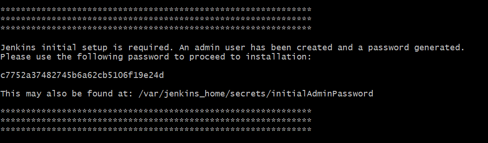
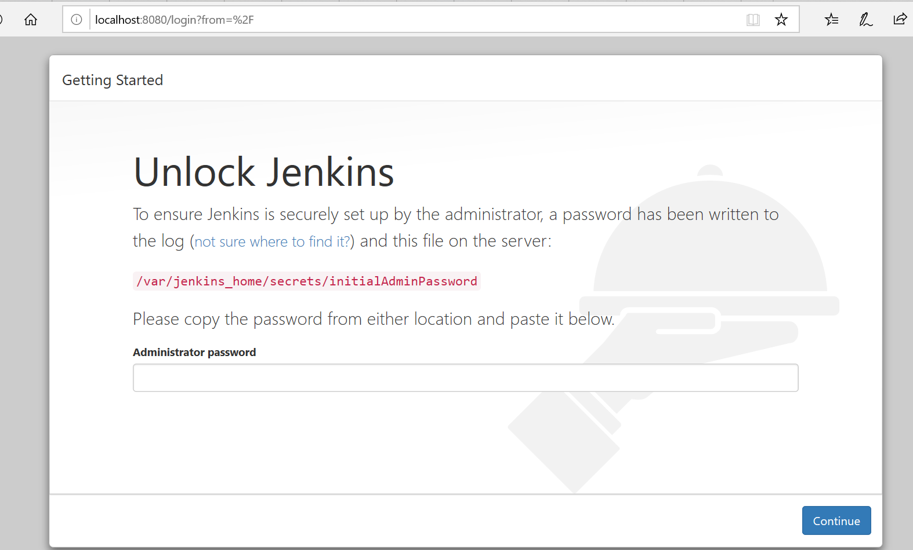
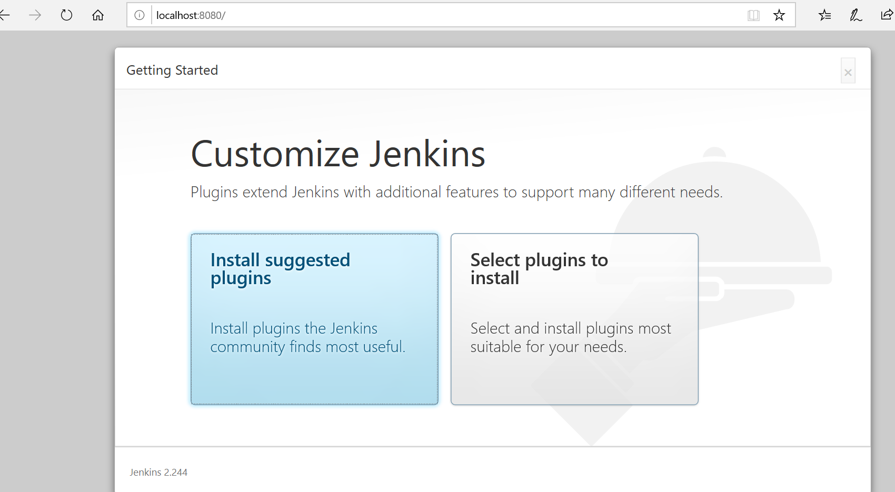
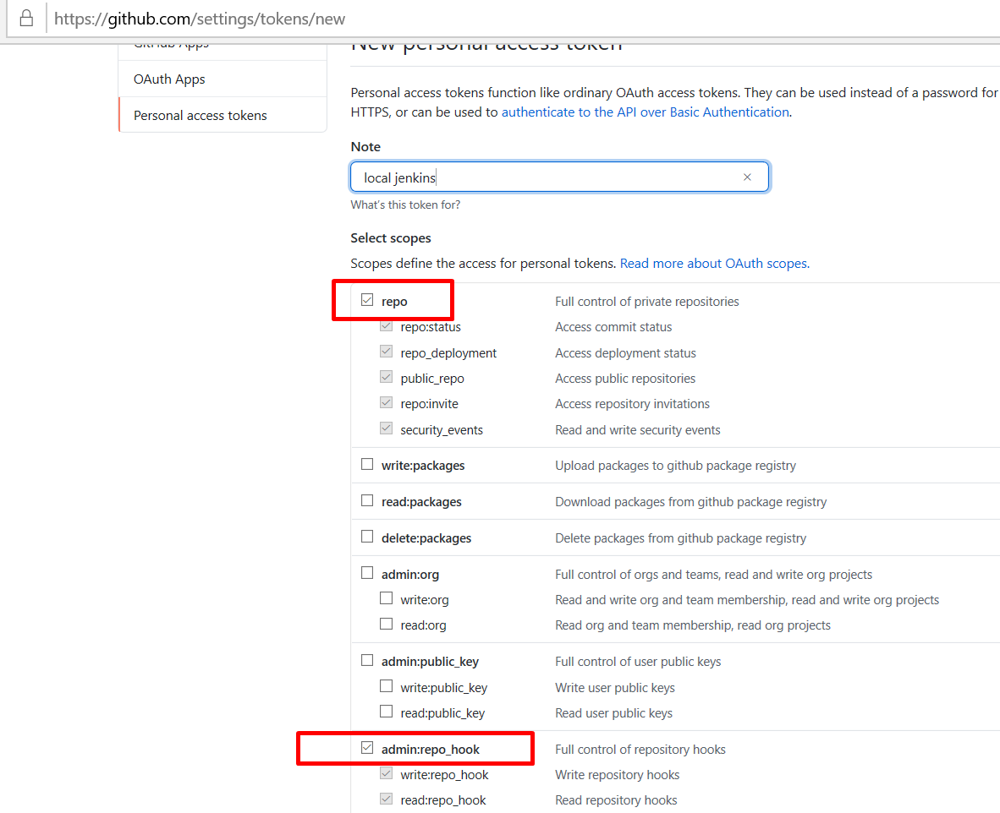

### 1. Overview
Sometimes it is very beneficial to have your own Jenkins:

* You have a ready Jenkins in your company but you are just learning Jenkins and you are pushing every little change
to the repository which makes them dirty
* You don't have a ready Jenkins and want to give it a try

Jenkins works with repositories which makes it a great tool for CI & CD. Communication between Jenkins and the repository
manager is bi-directional, where the repository manager (Github in our case) pushes changes to Jenkins and Jenkins also fetches
the repo from Github. So if you want to give it a try, Github must be able to access it. But it is not possible while you
are using Jenkins locally since **Github can not access your localhost:8080**. So you should install a Jenkins to a server
you own where this is not always possible.

In this article, we are going to set up everything from scratch with a basic & quick way and **we will integrate Github with
 locally running Jenkins.**

### 2. Install Jenkins with Docker
Docker is the easiest way to start using Jenkins. Here are the steps for downloading the docker image, starting a new container
and setting up Jenkins:

**1.** Start local Jenkins by running following command:

```
docker run -p 8080:8080 -p 50000:50000 -v jenkins_home:/var/jenkins_home jenkins/jenkins:lts
```

This creates a Jenkins on port 8080 with a volume **jenkins_home** managed by docker. It is not suggested by Jenkins 
to map the volume to the host, so we will keep the volume in this way. 

**2.** There is an initial administrator password in our terminal when we run above command:



Copy this password then go to localhost:8080. Enter password here and continue:



**3.** Select install suggested plugins and wait for the installation process finish. This will install plugins like Git, SVN, etc.
where we are going to use it in the next steps.



**4.** Optionally let's also create an admin user to later use instead of initial admin.


**5.** Finish the installation by applying the default URL since we will keep using localhost.


### 3. Create a Project in Github
You may already have a project, for the tutorial purpose let's also create a new fresh project **Github-integration-with-local-jenkins**
which is located [here](https://github.com/cmlonder/github-integration-with-local-jenkins)

And let's add a simple Jenkinsfile to the root of the project which simply echos Hello World

```
pipeline {
    agent any

    stages {
        stage('Hello') {
            steps {
                echo 'Hello World'
            }
        }
    }
}
```

### 4. Create an Access Token in Github
Jenkins will try to reach Github for a bunch of operations where it will need some access token. Let's create this token:

**1.** Click on your profile icon then select **Settings** from the dropdown then select **Developer Settings** from the
left navigation panel


**2.** Select **Personal access tokens** and click on **Generate new token**


**3.** Now we should select the scopes of our token. **repo** and **admin:repo_hook** scopes are enough for our operations.
Select them, give them a note, and generate the token.



**4.** Don't forget to **TAKE NOT** of this generated token since you will not able to see it again.


Now we are ready to create a job in Jenkins. We will use this token while configuring Github in the Jenkins.

### 5. Configure Github Server in Jenkins
Before creating a new job, let's add the token we generated in Github to our Jenkins.

**1.** Go to Jenkins Home and click on **Manage Jenkins** then select **Configure System**


**2.** Scroll down to the Github section. Click on **Add Github Server** then give it a name like **github api**. Check 
**Manage hooks**. We need to enter our credentials for Github. We will use the token we generated in the previous step.
Click on **Add** and select **Jenkins**


**3.** Now you see a popup to add a credential. Select **Global credentials** and **Secret text**.
Enter your generated access token which you created in the previous step from Github. Finally, enter a description (
**github access token** in this case) and add it.


**4.** As the last step, select the credential you created (github access token) in the popup and click on **Test connection**.
A response should appear on the screen which shows remaining API limits for your user. See 
[here](https://developer.github.com/apps/building-github-apps/understanding-rate-limits-for-github-apps/) for Github
API rate limit information, but it is enough for learning purposes.


We successfully added a credential to access Github APIs. Let's continue with creating a new job.

### 6. Create a New Job
We need to create a job in Jenkins by setting up our project URL and giving Github access so that Jenkins can fetch our
project to build it within our pipeline. Let's set it up step by step

**1.** Click on create a new item


**2.** Select **Pipeline** and give it a name
[here](https://github.com/cmlonder/go-dockerized-coverage).


**3.** Now we should configure our job. Click (or scroll) to **Build Triggers** section and check **Github hook trigger for GITScm polling**.


**4.** Click on **Pipeline** and select **Pipeline script from SCM** from Definition dropdown. This configures Jenkins 
job that we will use instructions from our project's  Jenkinsfile to run the pipeline. Enter your
*...git* repository URL.

### 7. Expose Your Localhost with NGROK
As mentioned at the beginning of the article, we need a way to Github to communicate with our local running Jenkins. There is a way
for it; exposing your local with a tunnel to the web. **NGROK** is the easiest way for this which makes it available with
a simple command. But it **SHOULD NOT** be used for production purposes.

First download ngrok for your operating system [here](https://ngrok.com/download)

Then type the following command in your terminal (if you did not add ngrok to PATH, cd into your ngrok download directory);

```
ngrok http 8080
```

This exposes your **8080** which is the port Jenkins is running on to the web via ngrok. After you type it, you should see
the exposed URL like following in your terminal:


Copy the Http forwarding URL and paste it to your browser, you will be redirected to your local Jenkins server. We are ready
to go to the next step, configuring Github for webhooks with Jenkins.

### 8. Configure Webhook URL for your Project in Github
Go to your project page and click on **Settings** tab. Then click **Webhooks** from the left navigation panel and
click on **Add webhook**. Now you should see the following screen:


For the Payload URL you should add your ngrok URL from previous step + **/github-webhook/** which 
will be ${YOUR_NGROK_URL}**/github-webhook/**. So my ngrok URL is: http://d9cdfa47e311.ngrok.io then my
Payload URL is **http://d9cdfa47e311.ngrok.io/github-webhook/** Trailing Slash **/** at the end is imported which may cause
redirection problem if you don't add. (Also you can't trigger this URL in the browser since /github-webhook provided by Jenkins
for **POST** requests)

Select **application/json** as content type and pick **Just the push event**. This configures when to call Jenkins if you want
to configure detailed hooks, select **Let me select individual events** and then you can pick the events like Pull Requests, Pushes,
Releases etc. to trigger calling your Jenkins endpoint.

Finally, add the webhook.

### 9. Push changes to Github to Trigger Local Jenkins Pipeline
Before triggering the job via push to Github, I had to trigger it once manually otherwise pipeline is not triggered. I could not
find a description for it but I guess plugin checks the local difference of the repository with the changes it 
received but it needs an initial pull of the repo to the local. So first build it manually once:


Now let's add a small change to the repo and push it. I changed my echo message from **Hello World** to **Hello World from localhost** and
pushed it to my repo.


And 2nd build is automatically triggered!


And if you click on the build details (#2 in the above screen) and then click **Console Output** you can see the build
details. Here are the important parts of log in my console;
* it shows that pipeline is started by a **push** to the repository
* with the commit message **hello from localhost** 
* and runs the Jenkinsfile in the repository by showing **Hello World from localhost**

```
Started by GitHub push by cmlonder

.... SOME MORE MESSAGE REGARDING GITHUB CHANGES ....

Commit message: "hello from localhost"

.... SOME MORE MESSAGE REGARDING GITHUB CHANGES ....

Hello World from localhost
[Pipeline] }
[Pipeline] // stage
[Pipeline] }
[Pipeline] // withEnv
[Pipeline] }
[Pipeline] // node
[Pipeline] End of Pipeline
Finished: SUCCESS
```

### 10. Summary
In this post, we made the integration of local Jenkins using Docker containers to the Github. Also, we saw how to create 
a job, add a Github credential, configure your pipeline with Jenkinsfile, add a webhook from your repository to your Jenkins.

You can find source code of this project in [Github](https://github.com/cmlonder/github-integration-with-local-jenkins)

### 11. Resources
* [https://www.jenkins.io/doc/book/pipeline/jenkinsfile/]()

