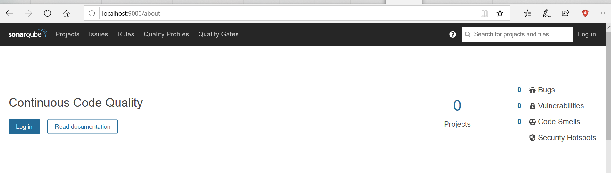
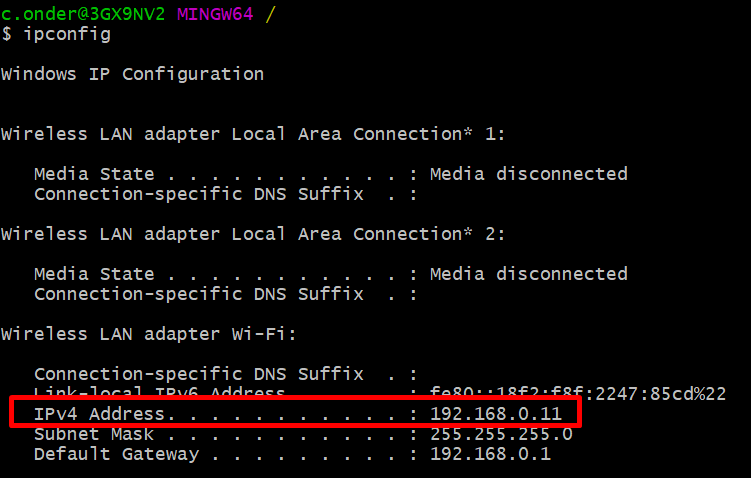
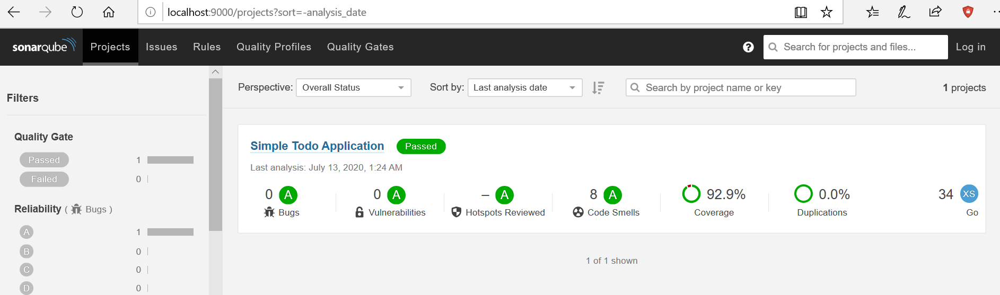

### Overview
In this series, we are going to integrate a Go project with Sonar using Docker.
[Part 1](/post/go-sonar-integration-using-docker-part-1) will be about creating a go application, writing unit tests, 
and generating code coverage then sending this report to SonarQube.
[Part 2 - TBD]() will be about using Sonar to fail pipeline based on the Quality report.

### 1. Create a Simple Todo App
Let's first create an empty project and initialize go modules.
```
mkdir go-dockerized-coverage
cd go-dockerized-coverage
go mod init cemalonder.com/go/todo
```

Create a todo folder and todo.go file
```
mkdir todo
touch todo.go
```
 
And write a simple Todo App with 2 functions; **Add** and **Complete**.

```
// Package todo provides a simple todo application
package todo

import "errors"

// Todo representation of todo with id, title and completed status
type Todo struct {
   Id       int
   Title    string
   Completed bool
}

// TodoApp holds todo list and id counter
type TodoApp struct {
   todos map[int]Todo
   id int
}

// CreateTodoApp creates a new TodoApp by initializing todo list and id counter
func CreateTodoApp() TodoApp {
   todoApp := TodoApp{}
   todoApp.todos = make(map[int]Todo)
   todoApp.id = 0
   return todoApp
}

// Add adds a new todo with given title and returns created todo with a new id
func (app *TodoApp) Add(title string) Todo {
   app.id = app.id + 1
   app.todos[app.id] = Todo{app.id, title, false}
   return app.todos[app.id]
}

// Complete completes a todo with given id and
// returns todo not found exception if todo with given id is not found
func (app *TodoApp) Complete(id int) error {
   if todo, ok := app.todos[id]; ok {
      todo.Completed = true
      app.todos[id] = todo
      return nil
   } else {
      return errors.New("todo not found")
   }
}
```

### 2. Write Unit Tests
Now let's create some unit tests for our Todo App. My Complete function contains some business logic which I can write
unit tests. I will consider business cases first, then implement them;
* When I complete a todo which exists, I expect it's completed state is true
* When I complete a todo which does not exist, I expect an error

```
package todo_test

import (
   "testing"
)

func TestCompleteForFoundTodo(t *testing.T) {
   app := CreateTodoApp()
   todo := app.Add("Wake up early")
   if todo.Completed {
      t.Error("Expected completed is false, but it is true")
   }

   err := app.Complete(todo.Id)

   if err != nil {
      t.Errorf("Expected error is nil, but it is %v", err)
   }

   if todo.Completed {
      t.Error("Expected completed is true, but it is false")
   }
}

func TestCompleteForNotFoundTodo(t *testing.T) {
   app := CreateTodoApp()
   err := app.Complete(1)
   if err == nil {
      t.Errorf("Expected error is not nil, but it is %v", err)
   }

}
```

I'm following some testing conventions above which starts with TestXxx(*testing.T). And also my package
name is todo_test. Since this post is about integrating Go with Sonar I will let keep them for another post, let's
continue with generating code coverage.

### 3. Generate Code Coverage
Let's run and generate coverage for our project:
```
go test ./... -v -coverprofile=coverage.out -covermode=count -coverpkg=./...
```

And if summarize what is above command and its flag is doing:

* **go test ./...** = running all the tests in current and all sub-folders
* **-v** = print full output
* **-coverprofile=coverage.out** = write coverage to the given file, here we write to coverage.out
* **-covermode=count** = Sets the mode for coverage analyses, here we set to count which shows how many times statements are run
* **-coverpkg=./...** = apply coverage for all matching pattern, here we applied current and all sub-folders

For the detailed list of all flags for go test command, see [here](https://golang.org/pkg/cmd/go/internal/test/)

Now we have a coverage.out generated in the root of the project content like this:
```
 mode: count
  cemalonder.com/go/todo/main.go:3.14,4.2 0 0
  cemalonder.com/go/todo/todo/todo.go:20.30,25.2 4 2
  cemalonder.com/go/todo/todo/todo.go:28.44,32.2 3 1
  cemalonder.com/go/todo/todo/todo.go:36.44,37.35 1 2
  cemalonder.com/go/todo/todo/todo.go:37.35,41.3 3 1
  cemalonder.com/go/todo/todo/todo.go:41.8,43.3 1 1
```

The next step is sending this coverage to Sonar so we can visualize it.

### 4. Start Local SonarQube
Even you will send your reports to a Sonar instance which you have in your company's server, let's try everything first
locally. It will be pretty easy using Docker.

Start a new SonarQube container:

```
docker run --rm -p 9000:9000 sonarqube
```

If we summarize above command;
* Installs **sonarqube** image if it does not exist locally
* Creates a container from this image
* Starts this container
* Forwards internal 9000 port of docker to host (localhost in this case) so you can access it via [localhost:9000]
* Removes container (--rm) when it is stopped so you don't run out of space (you still have the image)

Now we have a locally running sonarqube with no persistency (in-memory), so you will lose your pushed reports when you
restart your container but it is okay for our case since we want to test our reports.

If you visit [localhost:9000]() in your browser you will see local SonarQube instance with 0 projects.



We need to push our project to SonarQube. Let's continue with the next step.

### 5. Configure Sonar in Project
We need some configuration in our project before we push it to the SonarQube. In the next step, we will be using SonarScanner
which requires sonar-project.properties configured in the project. By default, it should be located at the root of the project.
Let's create **sonar-project.properties** in the root of the project and 

```
touch sonar-project.properties
```

And its content is:
```
sonar.language=go
# This should be unique in SonarQube
sonar.projectKey=simple-todo-app
sonar.projectName=Simple Todo Application
sonar.go.coverage.reportPaths=coverage.out
sonar.exclusions=**/*_test.go
```

And if we summarize the properties used above:
* **sonar.language** = we are setting our language but SonarQube also capable of guessing it
* **sonar.projectKey** = this should be unique in your SonarQube instance
* **sonar.projectName** = this will be shown in the UI as a name of our project
* **sonar.go.coverage.reportPaths** = we show our **coverage.out** which we generated in [write unit tests](#2-write-unit-tests) step
* **sonar.exclusions** = we are excluding _test.go files since we don't want to get coverage of tests itself
All of the properties can be found [here](https://docs.sonarqube.org/latest/analysis/analysis-parameters/). 

We have configured our project. The last step is pushing these to the SonarQube instance.

### 6. Send Coverage Report to SonarQube using SonarScanner
[SonarScanner](https://github.com/SonarSource/sonar-scanner-cli) is a tool used to run code analysis on SonarQube instance.
To use this we should install it locally and run against our project which has code coverage generated and sonar-project.properties
configured. But instead of installing locally, I would like to do this step also with Docker since SonarQube officially provides a [docker image](https://hub.docker.com/r/sonarsource/sonar-scanner-cli) for this.

Before running the sonar-scanner-cli docker command you should get your local IP since we will need it in the next step.
For this type `ipconfig` if you are working in Windows or `ifconfig` if you are in a Linux based Operating System. Then
take note of your **IPv4 Adress** for the valid Adapter, in my case I'm working via Wireless so I take note of my 
**Wireless Lan adapter Wi-Fi** which is 192.168.0.11 as follows



Now run following command in the shell (run it in PowerShell if you are in windows otherwise ${PWD} does not work)

```
 docker run --rm -e SONAR_HOST_URL=http://192.168.0.11:9000 -v ${PWD}:/usr/src sonarsource/sonar-scanner-cli
```

And if we summarize above command:
* Installs **sonarsource/sonar-scanner-cli** image if it does not exist locally
* Creates a container from this image
* Starts this container
* Sets **SONAR_HOST_URL** environment variable to show where SonarQube runs
* Creates a volume from **/usr/src** to your local (${PWD} or give your absolute path like /c/yourUser/yourProject) so
sonar-scanner-cli can use your local project and its properties (sonar-project.properties)
* Removes container (--rm) when it is stopped so you don't run out of space (you still have the image)

In your terminal you should see an **EXECUTION SUCCESS** message with a log similar to this:
```
...More logs...
INFO: Analysis report generated in 134ms, dir size=80 KB
INFO: Analysis report compressed in 681ms, zip size=12 KB
INFO: Analysis report uploaded in 260ms
INFO: ANALYSIS SUCCESSFUL, you can browse http://192.168.0.11:9000/dashboard?id=simple-todo-app
INFO: Note that you will be able to access the updated dashboard once the server has processed the submitted analysis report
INFO: More about the report processing at http://192.168.0.11:9000/api/ce/task?id=AXNFIP_bMJij3EBEF7zK
INFO: Analysis total time: 5.375 s
INFO: ------------------------------------------------------------------------
INFO: EXECUTION SUCCESS
INFO: ------------------------------------------------------------------------
INFO: Total time: 12.923s
INFO: Final Memory: 13M/47M
INFO: ------------------------------------------------------------------------
```

**NOTE:** You can not use [http://localhost:9000]() instead of [http://192.168.0.11:9000]() since sonar-scanner-cli Docker container runs
on its host and **localhost** for that container is not same address with localhost of yours (at least in Windows, Mac's 
docker daemon may be editing etc/hosts files so users in Mac MAY be using localhost even they are working in Docker)

Now if you visit [http://localhost:9000]() again, you will see there is 1 project now. Click on that and here is our report:



Since Sonar has default Quality Gates configured, I'm now passing all of the scores and we have **Passed** status.

### Summary
In this post, we write a simple Go project, generate coverage report, configure SonarScanner, and analyze our project in Sonar.
The [next part - TBD]() will be about integrating this project to Jenkins and reject our pipeline based on the project quality report.

You can find source code of this project in [Github](https://github.com/cmlonder/go-dockerized-coverage)

### Resources
* [https://docs.sonarqube.org/latest]()
* [https://blog.golang.org/cover]()
