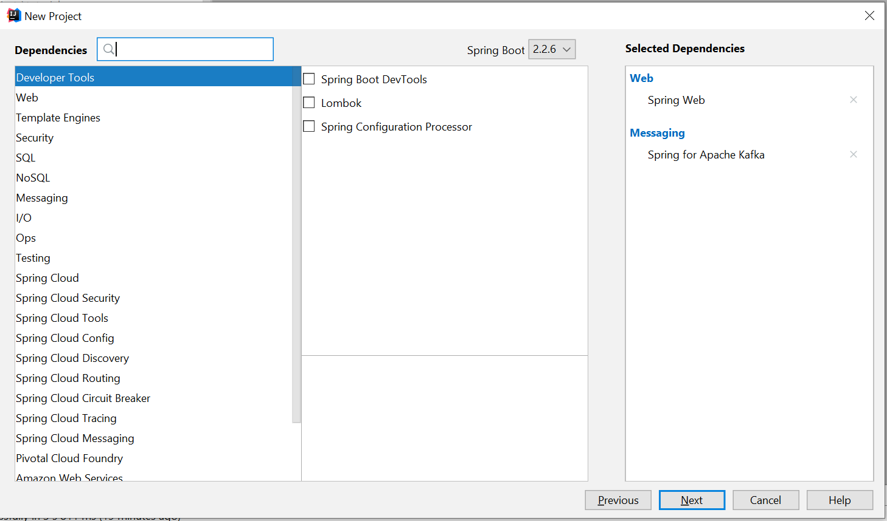

### 1. Overview
Apache Kafka is a distributed streaming platform that is used to send data between applications in real-time. It is 
good to have an overview of some Kafka terminology before going further;

**Topic:** Messages are published to

**Producer:** An application who can publish its messages to a topic

**Consumer:** An application that can consume messages from its subscribed topic.
Most simply, a producer writes messages to topics, and consumers can read messages from its subscribed topics. 
This allows applications to communicate asynchronously and fulfill high payloads. 

In this tutorial we are going to create a game announcement system;

**Topic:** Games

**Producer:** /games/score/?name=${playerName} endpoint where we are going to call with curl request when a 
A new score is made in our virtual football game.

**Consumer:** There will be 2 consumers. Radio and TV. They will consume our message and use it their business logic. 
This will show us how we can get the benefit of the publisher/subscriber system.


### 2. Application Setup
We need to prepare our environment by running Apache Kafka and its dependency on ZooKeeper. Kafka provides a simple 
ZooKeeper server for local purposes, but in production, it should be configured separately. Let's stick with basics in our tutorial: 

* Download Apache Kafka [here](https://kafka.apache.org/quickstart)
* Untar it:
```
tar -xzf kafka_2.12-2.5.0.tgz
cd kafka_2.12-2.5.0
```

#### 2.1. Start ZooKeeper Server
Kafka uses the ZooKeeper server to manage its topics. Start it:

**Linux**
```
./bin/zookeeper-server-start.sh config/zookeeper.properties
```

**Windows**
```
.\bin\windows\zookeeper-server-start.bat .\config\zookeeper.properties
```

#### 2.2. Start Kafka Server 
Start kafka server after ZooKeeper is up & ready:

**Linux**
```
./bin/kafka-server-start.sh config/server.properties
```

**Windows**
```
.\bin\windows\kafka-server-start.bat .\config\server.properties
```

#### 2.3. Create a topic
For simplicity, we are going to create a topic before our application is started. Create games topic with the following:

**Linux**
```
.\bin \kafka-topics.sh --create --bootstrap-server localhost:9092 --replication-factor 1 --partitions 1 --topic scores
```

**Windows**
```
.\bin\windows\kafka-topics.bat --create --bootstrap-server localhost:9092 --replication-factor 1 --partitions 1 --topic scores
```

#### 2.4. List topics
List topics in the Kafka, we will see scores topic is created.

**Linux**
```
.\bin\kafka-topics.bat –list –bootstrap-server localhost:9092
```

**Windows**
```
.\bin\windows\kafka-topics.bat --list --bootstrap-server localhost:9092
```

#### 2.5. Create the Project

Now we can start creating our application. We need the following dependencies:

**spring-boot-starter:** Provides our core Spring libraries. 

**spring-boot-starter-web:** We need it to provide a simple web server and REST operations

**spring-kafka:** Wraps Kafka to abstract messaging operations

**spring-boot-starter-test:** For core test libraries

**spring-kafka-test:** provides testing utils for Kafka

Our final pom.xml:
```
<?xml version="1.0" encoding="UTF-8"?>
<project xmlns="http://maven.apache.org/POM/4.0.0" xmlns:xsi="http://www.w3.org/2001/XMLSchema-instance"
       xsi:schemaLocation="http://maven.apache.org/POM/4.0.0 https://maven.apache.org/xsd/maven-4.0.0.xsd">
   <modelVersion>4.0.0</modelVersion>
   <parent>
      <groupId>org.springframework.boot</groupId>
      <artifactId>spring-boot-starter-parent</artifactId>
      <version>2.2.6.RELEASE</version>
      <relativePath/> <!-- lookup parent from repository -->
   </parent>
   <groupId>com.cmlonder.tutorials</groupId>
   <artifactId>spring-boot-kafka-tutorial</artifactId>
   <version>0.0.1-SNAPSHOT</version>
   <name>spring-boot-kafka-tutorial</name>
   <description>Spring Boot kafka integration tutorial</description>

   <properties>
      <java.version>1.8</java.version>
   </properties>

   <dependencies>
      <dependency>
         <groupId>org.springframework.boot</groupId>
         <artifactId>spring-boot-starter</artifactId>
      </dependency>

      <dependency>
         <groupId>org.springframework.boot</groupId>
         <artifactId>spring-boot-starter-web</artifactId>
      </dependency>

      <dependency>
         <groupId>org.springframework.kafka</groupId>
         <artifactId>spring-kafka</artifactId>
      </dependency>

      <dependency>
         <groupId>org.springframework.boot</groupId>
         <artifactId>spring-boot-starter-test</artifactId>
         <scope>test</scope>
         <exclusions>
            <exclusion>
               <groupId>org.junit.vintage</groupId>
               <artifactId>junit-vintage-engine</artifactId>
            </exclusion>
         </exclusions>
      </dependency>
      <dependency>
         <groupId>org.springframework.kafka</groupId>
         <artifactId>spring-kafka-test</artifactId>
         <scope>test</scope>
      </dependency>
   </dependencies>

   <build>
      <plugins>
         <plugin>
            <groupId>org.springframework.boot</groupId>
            <artifactId>spring-boot-maven-plugin</artifactId>
         </plugin>
      </plugins>
   </build>

</project>
```

Or you can also use Spring Initializr to generate above pom.xml quickly with the following selections:


### 3. Application Configuration
We need to configure our application.yml/properties with the following:

By default, our Kafka server started on port 9092 when we run in our terminal. We will use the default port and 
Serializer/Deserializer provided by Kafka. We configure our application to run on port 9000 and as the last step we 
give a group-id as a default group-id but we will change it per Consumer in the following steps.

```
server:
  port: 9000

spring:
  kafka:
    consumer:
      bootstrap-servers: localhost:9092
      group-id: group-id
      key-deserializer: org.apache.kafka.common.serialization.StringDeserializer
      value-deserializer: org.apache.kafka.common.serialization.StringDeserializer

    producer:
      bootstrap-servers: localhost:9092
      key-serializer: org.apache.kafka.common.serialization.StringSerializer
      value-serializer: org.apache.kafka.common.serialization.StringSerializer
```

### 4. Create a Controller
We provide /games/score endpoint with the name request param. This controller then delegates its job to Scores class with incoming name.

```
@RestController
@RequestMapping(value = "/games")
public class GameController {

  private final Scores scores;

  @Autowired
  public GameController(Scores scores) {
    this.scores = scores;
  }

  @PostMapping(value = "/score")
  public void makeAnnouncement(@RequestParam("name") String name) {
    this.scores.sendMessage(name);
  }

}
```

### 5. Create a Producer
Create producer package and Scores file inside it as following:

```
@Service
public class Scores {

  private final Logger logger = LoggerFactory.getLogger(Scores.class);
  private static final String TOPIC = "scores";

  private final KafkaTemplate<String, String> kafkaTemplate;

  @Autowired
  public Scores(KafkaTemplate<String, String> kafkaTemplate) {
    this.kafkaTemplate = kafkaTemplate;
  }

  public void sendMessage(String name) {
    logger.info("Publishing message to {} topic", TOPIC);
    this.kafkaTemplate.send(TOPIC, name + " is scored a new goal!");
  }

}
```
This class is annotated with Service annotation and it's now inside Spring Context. We are using KafkaTemplate to 
easily send messages to the given topic, since our class is already in Spring Context we can use Autowired annotation 
in our constructor and inject KafkaTemplate to our class.  Then we are calling KafkaTemplate’s send method with the 
score topic we already created and message for the topic.

### 6. Create Consumers
We will create two Consumers for the score topic. First, create consumers package and TvConsumer class in it as follows:

#### 6.1. First Consumer: TV
This class is annotated with Service annotation and its now inside Spring Context similar to the provider above. 
We are using KafkaListener annotation provided by spring-kafka to listen given topic. It is listening to players' 
topics with its unique groupId which is the tv in this case. By giving different groupId’s, multiple consumers can listen to the same topic. 
In the end, the TvConsumer class logs a simple message that shows it is handled by the TV.

```
@Service
public class TvConsumer {

  private final Logger logger = LoggerFactory.getLogger(TvConsumer.class);
  private Integer score = 0;

  @KafkaListener(topics = "scores", groupId = "tv")
  public void consume(String message) {
    logger.info("{}. This is outstanding to watch on TV. Score now {} - 0!", message, ++score);
  }

}
```

#### 6.2. Second Consumer: Radio
Similar to the TvConsumer, RadioConsumer listens to players' topic with its groupId and logs its special message.
```
@Service
public class RadioConsumer {

  private final Logger logger = LoggerFactory.getLogger(RadioConsumer.class);
  private Integer score = 0;

  @KafkaListener(topics = "scores", groupId = "radio")
  public void consume(String message) {
    logger.info("{}. Score is now {}-0 for the people who just turned on their Radios!", message,
        ++score);
  }

}
```

### 7. Send a Message To Topic
Now let's try to send a message to the topic using basic curl:

```
curl -X POST localhost:9000/games/score?name="Ronaldo"
```

And let's see the results in our console:

```
c.c.t.s.producer.Scores: Publishing message to scores topic
c.c.t.s.consumer.RadioConsumer: Ronaldo is scored a new goal!. Score is now 1-0 for the people who 
c.c.t.s.consumer.TvConsumer: Ronaldo is scored a new goal!. This is outstanding to watch on TV. Score now 1 - 0!
```

### 8. Summary
In this post, we created kafka topic, send messages via a producer and retrieve them via multiple consumers from same
topic using Spring Boot Kafka libraries.

You can find source code of this project in [Github](https://github.com/cmlonder/spring-boot-kafka-tutorial)

